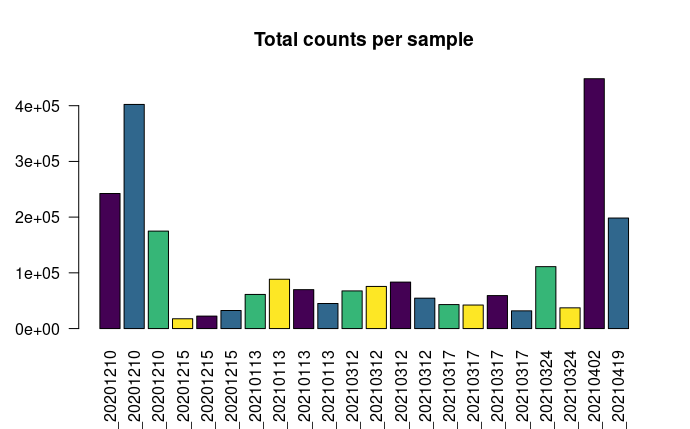
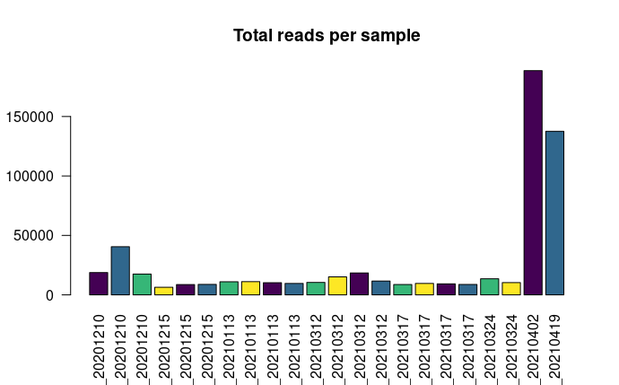
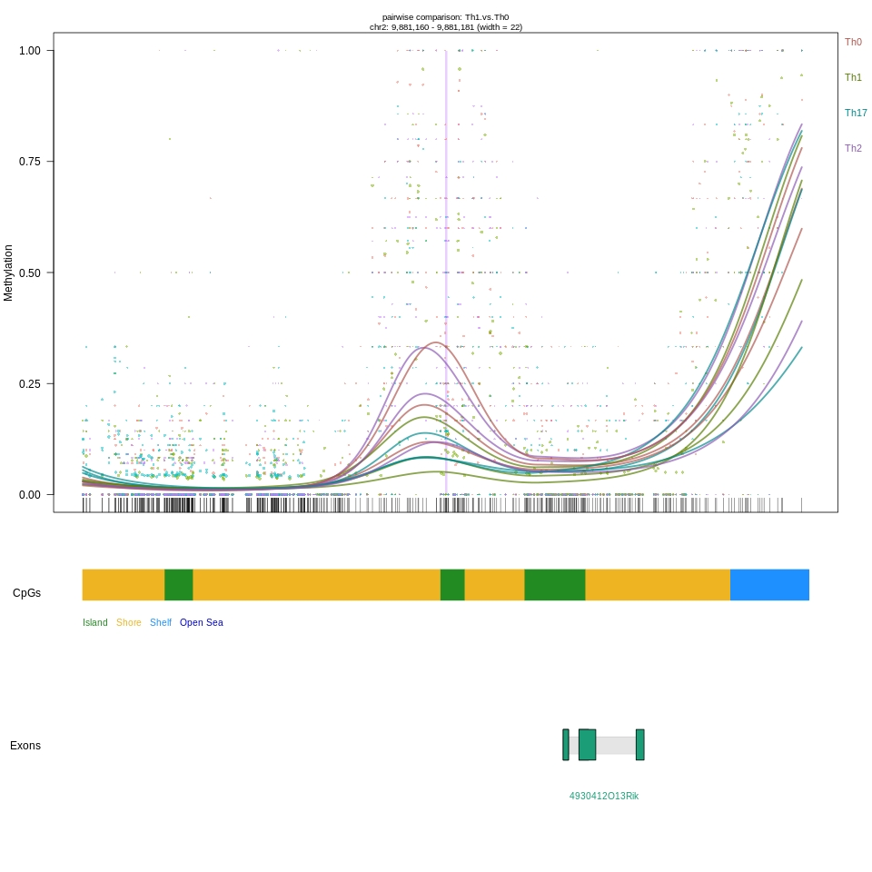

```{=html}
<style type="text/css">
#TOC {
  color: #008cff; 
  position: fixed;
}
</style>
```
## T cell identification using long read modifications

### Summary

this web site is for scientific research results for the moment its a statistic web site that contain many plots from recent analysis scripts as mentioned this is a first try for the web site below we have an.

### References:

in here we keep the references.

## Rationale

### Link to BioRxiv

this web site containes many parts like this one from recent analysis scripts.as mentioned this is a first try for the web site below we have a plot that demostrate the methylation. 

### References

..

## Methods

### Link to Git hub

this web site is a result of analysis R scripts pushed on the reposetory *myreposetory* 

### References

..


## Browse by celle type

### Select cell type of interest:

### Select modification (5mC/5hmC):

```{r , echo=FALSE, message=FALSE, width = "100%"}


library(shiny)

library(rtracklayer)
library(phylobase)
library(bsseq)
library(dmrseq)
#library(DMRcate)
library(scales)
library(BSgenome.Mmusculus.UCSC.mm10)
library(scales)
library(pals)


annoTrack <- getAnnot("mm10")


regions <- read.csv("/home/tgfb/Documents/hani-1/hani-main/targeted.regions.csv",sep = ",",skip = 0, col.names = c("symbol","chr","start","end"))


inputPanel(
  
  
  selectInput("n5", label = "Select gene of interest:",
              choices = c(regions$symbol), selected = "Foxp3"),
  selectInput("n1", label = "Cell type 1",
              choices =  c("DMK", "Treg" ,"tTreg" , "Th0" ,"Th1" ,"Th17" ,"Th2" , "Th17_noTGFb" , "Th17_TGFb.KO","Th17_TGFb.WT"
                           ), selected = "DMK"),
  selectInput("n2", label = "Cell type 2",
             choices = c("DMK", "Treg" ,"tTreg" , "Th0" ,"Th1" ,"Th17" ,"Th2" , "Th17_noTGFb" , "Th17_TGFb.KO","Th17_TGFb.WT")
              , selected = "Treg"),

  selectInput("n3", label = "Select modification (5mC/5hmC)",
              choices = c("5mC","5hmC"), selected = "5mC"),
  downloadButton(outputId = "down", label = "Download the plot")

)
print(regions$symbol)
mainPanel(
  fluidRow(
     plotOutput("plot1", width = "800px", height = "500px")
  )
)


  # front end interface


   
  observeEvent(input$n3,{
    if (input$n3 == "5mC") {
      
      n1 <- reactive(input$n1)
      n2 <- reactive(input$n2)
      n3 <- reactive(input$n3)
      n5 <- reactive(input$n5)
      load("BSobj_5mCpG_integrated.RData")
  
#regions2 <- reactive({
#   regions[ regions$symbol == as.character(input$n5), ]
#  })


pheno <- pData(BSobj)

      
pheno$group[19] <- "Th17_noTGFb"
pheno$group[20] <- "Th17_noTGFb"


library(pals)
#group.colors <- alphabet(10)
#library(Polychrome)
# build-in color palette
#group.colors = glasbey.colors(10)
group.colors <- rainbow(10)
group.colors <- c(rainbow(10), alphabet(10))
library(scales)
#show_col(group.colors)
#show_col(group.colors[c(1,2,3,6,8,9,15,13,19,20)])

pheno$col <- pheno$group
pheno$col <- gsub("DMK", group.colors[1], pheno$col)
pheno$col <- gsub("Th0", group.colors[2], pheno$col)
pheno$col <- gsub("Th17_noTGFb", group.colors[3], pheno$col)
pheno$col <- gsub("Th17_TGFb.KO", group.colors[6], pheno$col)
pheno$col <- gsub("Th17_TGFb.WT", group.colors[8], pheno$col)
pheno$col <- gsub("Th2", group.colors[9], pheno$col)
pheno$col <- gsub("tTreg", group.colors[15], pheno$col)
pheno$col <- gsub("Treg", group.colors[13], pheno$col)
pheno$col <- gsub("Th17", group.colors[19], pheno$col)
pheno$col <- gsub("Th1", group.colors[20], pheno$col)

pData(BSobj) <- pheno


sel.num <- 11 # selected region
  

   
  
output$plot1 <- renderPlot({
  
BSobj3<- BSobj[ ,BSobj$group == as.character(n1()) ]
BSobj4<- BSobj[ ,BSobj$group == as.character(n2()) ]

BSobj5<-cbind(BSobj3,BSobj4)
n52 <- as.character(n5())
#cbind(BSobj[ ,BSobj$group == as.character(n1()) ],BSobj[ ,BSobj$group == as.character(n2()) ])
myPlot2 <- function(){
plotDMRs(
BSobj5, regions[ regions$symbol == as.character(n52), ], testCovariate="group", addRegions = NULL, 
         main = paste0(as.character(n5()), " Targeted Region_5mC"),
         extend = 0, annoTrack = annoTrack, highlightMain = F, qval = F, stat = F, horizLegend = T)}

   myPlot2()

   output$down <- downloadHandler(
    filename =  function() {
      paste("5mC", as.character(n52), sep=".")
    },
    # content is a function with argument file. content writes the plot to the device
    content = function(file) {
    png(file)
    print(myPlot2())
    dev.off()

    } 
)

})

     
    }
    
    if (input$n3 == "5hmC") {
      load("BSobj_5hmCpG_integrated.RData")
      n1 <- reactive(input$n1)
      n2 <- reactive(input$n2)
      n3 <- reactive(input$n3)
      n5 <- reactive(input$n5)
      pheno <- pData(BSobj)
      pheno$group[19] <- "Th17_noTGFb"
      pheno$group[20] <- "Th17_noTGFb"


group.colors <- rainbow(20)


pheno$col <- pheno$group
pheno$col <- gsub("DMK", group.colors[1], pheno$col)
pheno$col <- gsub("Th0", group.colors[2], pheno$col)
pheno$col <- gsub("Th17_noTGFb", group.colors[3], pheno$col)
pheno$col <- gsub("Th17_TGFb.KO", group.colors[6], pheno$col)
pheno$col <- gsub("Th17_TGFb.WT", group.colors[8], pheno$col)
pheno$col <- gsub("Th2", group.colors[9], pheno$col)
pheno$col <- gsub("tTreg", group.colors[15], pheno$col)
pheno$col <- gsub("Treg", group.colors[13], pheno$col)
pheno$col <- gsub("Th17", group.colors[19], pheno$col)
pheno$col <- gsub("Th1", group.colors[20], pheno$col)

pData(BSobj) <- pheno


sel.num <- 11
output$plot1 <- renderPlot({
  
BSobj3<- BSobj[ ,BSobj$group == as.character(n1()) ]
BSobj4<- BSobj[ ,BSobj$group == as.character(n2()) ]

BSobj5<-cbind(BSobj3,BSobj4)
n52 <- as.character(n5())

myPlot1 <- function(){
plotDMRs(
BSobj5, regions[ regions$symbol == as.character(n52), ], testCovariate="group", addRegions = NULL, 
         main = paste0(as.character(n5()), " Targeted Region_5hmC"),
         extend = 0, annoTrack = annoTrack, highlightMain = F, qval = F, stat = F, horizLegend = T)}
 myPlot1()
    output$down <- downloadHandler(
    filename =  function() {
      paste("5hmC", as.character(n52),as.character(n1()),as.character(n2()), sep=".")
    },
    # content is a function with argument file. content writes the plot to the device
    content = function(file) {
    png(file)
    print(myPlot1())
    dev.off()

    } 
)
    })
   

    }
  })


```


## Browse by gene

### Select gene of interest:

### Select modification (5mC/5hmC):



```{r , echo=FALSE, out.width="100%", out.height="400px", fig.cap="caption", fig.show='hold', fig.align='center'}


```


```{r, echo=FALSE}
#load("BSobj_5mCpG_integrated.RData")

```


## Credits

### About us:

.. ..
