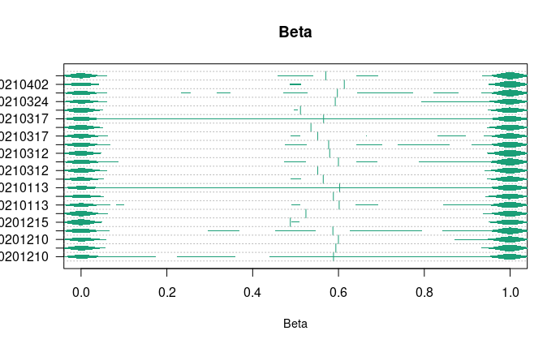
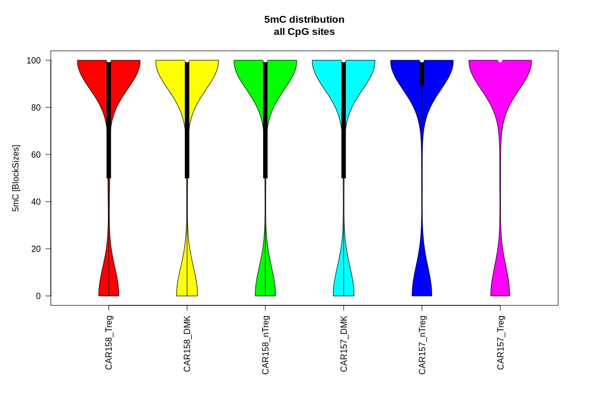
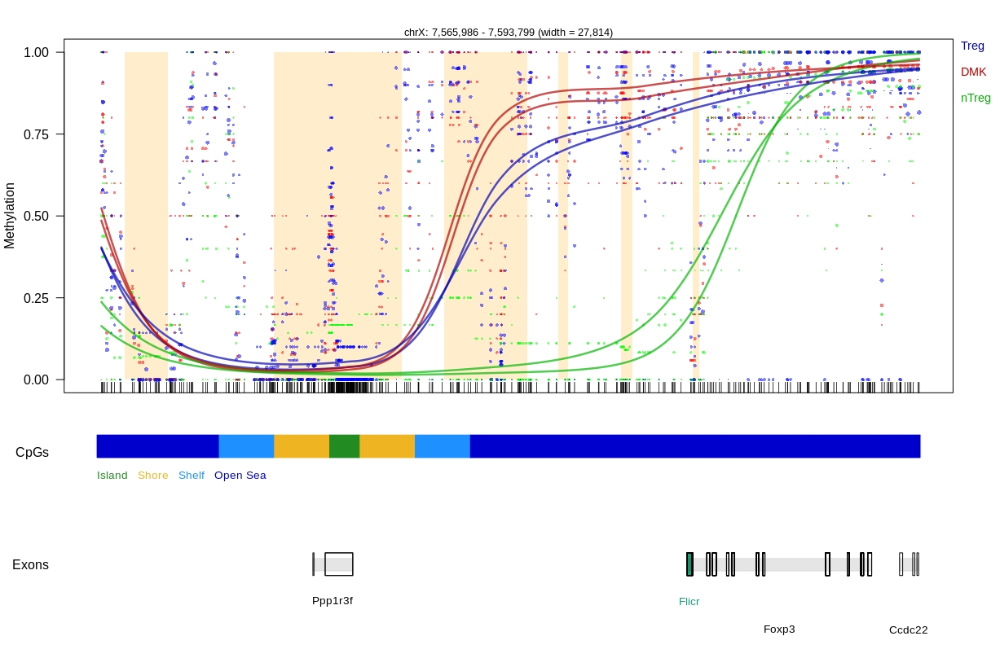

## Home

### this web site is for scientific research results

for the moment its a statistic web site that contain many plots from recent analysis scripts as mentioned this is a first try for the web site below we have an *densityBeanPlot* 

## Rationale

## this web site containes many parts like this one

 from recent analysis scripts.as mentioned this is a first try for the web site below we have a plot that demostrate the methylation. 

## Methods

## Browse by gene

## Browse by cell type

## Compare cell types

## Credits 

